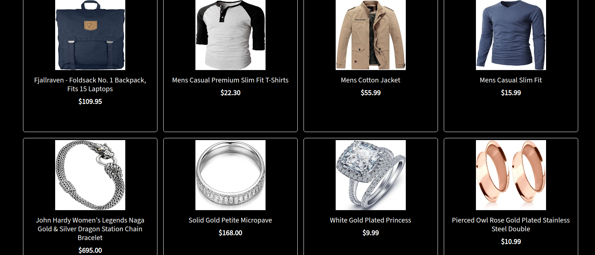
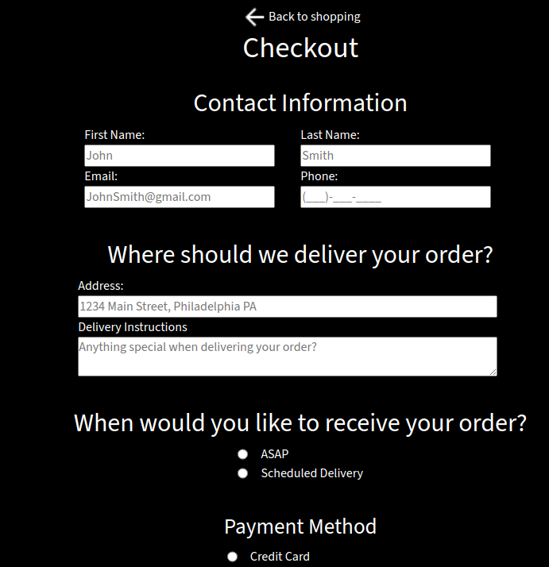

<h1>About This Project</h1> 
I created a full stack online E-Commerce website where customers could browse items, view item descriptions, add items to their cart, fill out a delivery and checkout form which is stored in a database and view computed totals for their purchases. This project uses MongoDB, Express.js, React.js, Node.js, React Router, state management, a third-party API, and a responsive design that looks great on any device. 

<br> 

<h1>What I learned</h1>
    <ul>
    <li>Using react router to link to different parts of the webpage</li>
    <li>Gained experience with MongoDB and storing form data in the database</li>
    <li>Using express middleware</li>
    <li>Implementing Bootstrap components such as cards</li>
    <li>Further increasing knowledge of responsive design and best practices</li>
    <li>Practice with state to keep track of total price, number of items in shopping cart</li>
    <li>Getting more experience with API's and using Axios. Utilized FakeStoreAPI for this project to retrieve clothing, electronics and jewelry items</li>
    <li>Gained more experience using CSS animations to apply fade in effects</li>
    <li>Implemented advanved CSS knowledge by using multiple flexbox containers to create complex designs and layouts</li>
    <li>Developed communication skills, persistance, and team-work by working with another professional developer and also other students who guided me along the journey</li>
    </ul>
 

 <h1>Build With</h1>

 
 
  
 
 
  
 
 


<h1>Getting Started</h1>

To get project cloned locally: git clone git@github.com:alecnissen/Shopping-Cart.git

then ``` npm install ``` which will install all dependency's and packages.

<h1>Features</h1>

- Fade in animation on home page that shuffles through a couple different sets of pictures which go along with the website theme. 

<div>


<div>

- Shopping cart component which fetches images from FakeStoreAPI while correctly displaying key information



- Each product has its own page where users can add the product, read a description and choose a quantity. 


- Checkout page which correctly calculates total price.


- When checkout form is completed it will be stored in a database using MongoDB. Checkout form data is also handled with Node.js and Express.js for form validation and asynchronous operations



- Search modal that allows user to search for specific products. 


- Mobile responsive 


<div>
<!--  
 -->
</div>


<h1>Acknowledgments</h1> Thank you to everyone within The Odin Project Curriculum from the bottom of my heart! Thank you to anyone who helped me in the discord channels. I promise to help others throughout this journey. 

<h1>Contact</h1>

Creator: Alec J Nissen 
<br>
E-Mail: alecnissen@yahoo.com
<br>
GitHub: https://github.com/alecnissen/Shopping-Cart
<br>
Live Link: https://fashiongems.netlify.app
