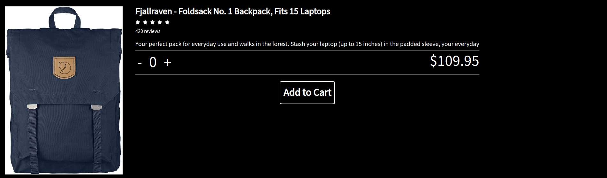

<h1>About This Project</h1> 
This was the final project in the React section as part of The Odin Projects course. This was an extremely challenging project, between implementing core react concepts such as state, props and using components, to making sure the user can properly add items to their cart, deleting items, calculating total price. With that being said, I did walk away learning a lot about react and core web development technologies. The overall purpose of the project was to get used to using react router and to build an online shopping store.

<br> 

<h1>What I learned</h1>
    <ul>
    <li>Using react router to link to different parts of the webpage</li>
    <li>Implementing Bootstrap components such as cards</li>
    <li>Further increasing knowledge of responsive design and best practices</li>
    <li>Practice with state to keep track of total price, number of items in shopping cart</li>
    <li>Getting more experience with API's and using Axios. Utilized FakeStoreAPI for this project to retrieve clothing, electronics and jewelry items</li>
    <li>Gained more experience using CSS animations to apply fade in effects</li>
    <li>Implemented advanved CSS knowledge by using multiple flexbox containers to create complex designs and layouts</li>
    <li>Developed communication skills, persistance, and team-work by working with another professional developer and also other students who guided me along the journey</li>
    </ul>
 

 <h1>Build With</h1>

 
  
  
 
 


<h1>Getting Started</h1>

To get project cloned locally: git clone git@github.com:alecnissen/Memory-Card.git

then ``` npm install ``` which will install all dependency's and packages.

<h1>Features</h1>

- Fade in animation on home page that shuffles through a couple different sets of pictures which go along with the website theme. 

<div>


<div>

- Shopping cart component which fetches images from FakeStoreAPI while correctly displaying key information


- Each product has its own page where users can add the product and choose a quantity. 



- Checkout page which correctly calculates total price.


- Search modal that allows user to search for specific products. 


- Mobile responsive 


<div>
<!--  
 -->
</div>


<h1>Acknowledgments</h1> Thank you to everyone within The Odin Project Curriculum from the bottom of my heart! Thank you to anyone who helped me in the discord channels. I promise to help others throughout this journey. 

<h1>Contact</h1>

Creator: Alec J Nissen 
<br>
E-Mail: alecnissen@yahoo.com
<br>
GitHub: https://github.com/alecnissen/Memory-Card
<br>
Live Link: https://memory-card-game-top.netlify.app/
